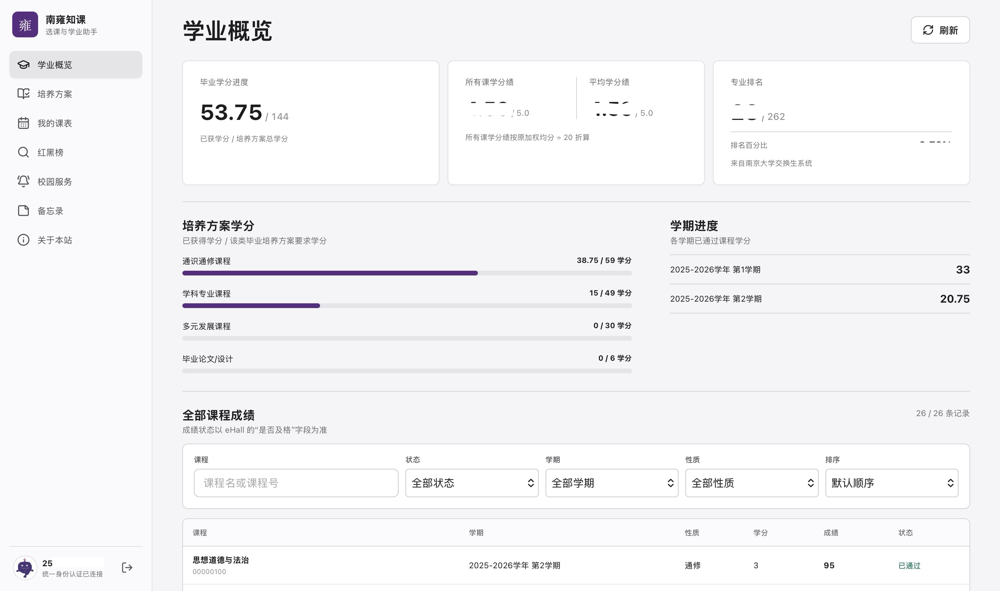

# 南雍知课

nju一站式选课与学业助手。登录南京大学统一身份认证后，可在同一本地界面查看成绩与学分、培养方案、个人课表和公开红黑榜等，在用户电脑本地运行,由浏览器显示界面。

> 本项目是个人开发的非官方工具，与学校官方无隶属关系。课程、成绩与培养方案请以学校系统最终结果为准。

## 界面预览

<p align="center">
  <a href="https://eurus07e.github.io/nanyong-zhike-app/"></a>
</p>

<p align="center">
  <strong><a href="https://eurus07e.github.io/nanyong-zhike-app/">View More</a></strong><br>
</p>

## 下载和启动

**第一步：下载**

 [转跳 Release 页面下载](https://github.com/Eurus07e/nanyong-zhike-app/releases/tag/v1.1.7)
> Mac 版本目前仅支持 Apple 芯片，您可在苹果菜单的“关于本机”中查看芯片类型。

**第二步：安装或解压**

- Windows：运行安装程序，可勾选创建桌面快捷方式。
- macOS：打开 DMG，将“南雍知课”拖入“应用程序”。
- Linux：完整解压 ZIP；不要直接在压缩包预览窗口中运行。

**第三步：启动**

- Windows：双击桌面或开始菜单中的“南雍知课”。
- macOS：首次按住 Control 点击“南雍知课”并选择“打开”，以后直接双击。
- Linux：允许 `南雍知课.desktop` 作为程序执行后双击，也可运行 `启动南雍知课.sh`。

需要结束后台服务时，点击网页左下角的电源图标“退出本地应用”。

### 首次打开提示

Windows 如果显示 SmartScreen 提示，请选择“更多信息”，再选择“仍要运行”。

macOS 如果仍然拦截启动，请打开“系统设置 > 隐私与安全性”，在安全性提示旁选择“仍要打开”。

v1.1.7 安装包未进行 Windows 代码签名或 Apple 公证，因此首次打开时出现上述系统提示属于预期情况。继续前请确认文件来自本仓库的 [Release 页面](https://github.com/Eurus07e/nanyong-zhike-app/releases/tag/v1.1.7)；不要关闭 SmartScreen、Gatekeeper 或其他系统安全防护。

Linux 如果双击没有反应，请在文件属性中允许 `启动南雍知课.sh`“作为程序执行”；也可以在解压目录中运行：

```bash
chmod +x '启动南雍知课.sh' NanyongZhike
./'启动南雍知课.sh'
```

首次启动可能稍慢，因为程序需要初始化红黑榜数据。程序仅监听本机地址，不会向局域网或公网开放服务。请只从本仓库的 [Releases 页面](https://github.com/Eurus07e/nanyong-zhike-app/releases/latest) 下载安装包。

## 包含功能

- 统一身份认证登录，在本机安全保留登录状态，并支持主动退出。
- 学业概览：全部课程成绩筛选与排序、所有课学分绩、平均学分绩、专业排名和培养方案学分进度。
- 培养方案：按年级、院系、类型和名称筛选，查看可缩放结构图、学年模式、课程组详情并进行筛选与排序。
- 我的课表：查看教学班及全部时间安排。
- 红黑榜：按课程、教师或“课程名 + 教师名”组合搜索。内容来自 nju-class 。
- 备忘录：新建、编辑、删除和置顶记录，支持搜索与 `#标签`。


## 本地数据与隐私

密码只在发起本次南京大学统一身份认证时存在于进程内存，不会写入数据库、浏览器存储或日志。SQLite 会保存学号、会话创建/到期时间和最近访问时间；学校认证票据以加密形式保存，会话令牌只保存摘要。默认会话有效期为 7 天。浏览器只持有随机的 `HttpOnly` 会话 Cookie；浏览器本地还会按学号保存最近浏览的培养方案选择和 NJU Tabs 设置，用于恢复界面偏好，不保存密码或学校认证票据。为先显示上次结果并在后台刷新，SQLite 会按学号保存最近一次成绩、排名、课表和培养方案加密快照；浏览器仅在当前会话内存中使用这些启动快照，不持久保存学业数据。备忘录正文会持久保存在运行南雍知课的同一个 SQLite 数据库中，按统一身份认证学号隔离，不发送给 Memos 或其他第三方。删除备忘录后，对应记录会从数据库删除。使用本地桌面版时，数据只保存在下方本机数据目录；使用他人维护的共享部署时，服务维护者能够接触服务器上的数据库，因此只应使用可信部署。本地程序会保存会话记录、本机密钥、备忘录和红黑榜索引：

| 系统 | 数据目录 |
| --- | --- |
| macOS | `~/Library/Application Support/NanyongZhike` |
| Windows | `%LOCALAPPDATA%\NanyongZhike` |
| Linux | `${XDG_DATA_HOME:-~/.local/share}/NanyongZhike` |

删除对应目录可彻底重置南雍知课的本地状态；退出登录只会立即使当前会话失效，删除目录还会清除本机保存的加密票据、数据库和本机密钥。公共电脑尽量不要使用本工具；必须使用时，请退出登录、关闭启动窗口，并删除对应数据目录。

### 安全提示

排名与平均学分绩来自南京大学交换生系统。本地发行包已默认启用这两项功能，登录后进入“学业概览”时会自动请求该系统，用户不需要手动修改配置。学校系统目前只提供 HTTP，无法获得 HTTPS 的机密性和完整性保护。查询过程中，学校认证后的单次票据、交换系统会话以及返回的排名数据会经过这条 HTTP 链路；同一网络中的攻击者或不可信代理可能观察或篡改这些通信。公网服务器部署默认关闭这条链路，除非维护者明确设置 `ALLOW_INSECURE_EXCHANGE_SYSTEM=true`。

## 常见问题

**双击后浏览器没有打开**

等待几秒后手动打开 <http://127.0.0.1:8000>。如果仍无法访问，查看本机数据目录中的 `launcher.log`；日志不会记录密码。

**关闭网页后程序还在运行**

网页只是界面。重新打开应用可再次打开页面；需要停止本地服务时，请点击网页左下角电源图标“退出本地应用”。

**登录或 eHall 查询失败**

先确认浏览器能正常打开南京大学统一身份认证和 eHall，再重启南雍知课。学校系统临时维护、网络环境或认证状态都可能造成查询失败。

**排名或平均学分绩暂时没有显示**

这两项数据来自独立的学校旧系统。其暂时不可用时，不影响成绩、课表和培养方案查询；稍后刷新即可重试。公网部署默认不会请求该系统。


## 版本路线

- `v1.1.0`：培养方案与课程认定修复、中文轻量备忘录、结构图缩放。
- `v1.1.1`：加密成绩快照、新成绩提示、成绩详情批量查询和校园服务模块界面。
- `v1.1.2`：悦读经典计划按标准课程条目展示，并参与课程进度筛选与排序。
- `v1.1.3`：完善通识课程缺项展示、通知正文与备忘录联动，并新增 NJU Tabs。

- `v1.2.0`：计划接入五育、劳育与第二课堂信息。
- `v1.3.0`：计划接入南京大学邮箱系统。


## 开发与验证

开发环境需要 Python 3.11+、Node.js 20+ 和 `nju-cli` 1.4.6。以下命令适用于 macOS 和 Linux：

```bash
python3 -m venv .venv
.venv/bin/pip install -e '.[dev]'
npm ci --prefix frontend
npm run build --prefix frontend
NJU_CLI_BIN=/path/to/nju-cli .venv/bin/uvicorn backend.app.main:app --reload
```

Windows PowerShell：

```powershell
py -3 -m venv .venv
.\.venv\Scripts\python.exe -m pip install -e ".[dev]"
npm ci --prefix frontend
npm run build --prefix frontend
$env:NJU_CLI_BIN = "C:\path\to\nju-cli.exe"
.\.venv\Scripts\python.exe -m uvicorn backend.app.main:app --reload
```

提交前执行：

```bash
npm run lint --prefix frontend
npm run test:unit --prefix frontend
npm run build --prefix frontend
.venv/bin/pytest -q
```

如需在开发环境启用排名接口，请在只监听本机的 `.env` 中设置 `ALLOW_INSECURE_EXCHANGE_SYSTEM=true`。不要在不受信任的公网服务器上启用。

Docker/Caddy 配置保留用于开发者自行部署。生产部署必须使用 HTTPS、独立随机 `APP_SECRET`，并保护 `.env` 与数据卷；交换生系统的上游 HTTP 风险仍然存在。

## 发布与构建

v1.1.7 发行包由 [GitHub Release 工作流](.github/workflows/release.yml) 在 GitHub 托管的 macOS、Windows 和 Linux 原生环境中构建，没有使用维护者的 Mac 制作其他平台安装包。macOS 发布 DMG，Windows 发布带可选桌面快捷方式的安装程序，Linux 发布便携 ZIP；ZIP 审计包仍随 Release 提供。

工作流会校验固定的 nju-cli v1.4.6 源码、应用公开的缓存隔离补丁、运行完整测试，并在每个平台真实启动安装包，检查内置 `nju-cli`、本地 API、首页、4 张登录图、头像、“雍”图标、固定 SHA-256 的支付宝收款码和备忘录数据库表结构。Windows 安装器还会在普通 CI 和原生编译前使用固定校验值的简体中文语言文件执行 Inno Setup 预检。补丁以确定性脚本施加，等价完整 diff 随包提供。Windows、macOS 或 Linux 任一检查失败时均不会发布 Release。

发布工作流仅监听准确的 `v1.1.7` 标签，以防其他标签被误发布为该版本。

## 开源与许可

南雍知课按 [GNU GPL v3](LICENSE) 发布。项目通过独立子进程调用 [nju-cli](https://github.com/nju-cli/nju-cli)，并使用 [nju-class](https://github.com/carottX/nju-class) 的公开评价数据；备忘录交互受到 MIT 许可的 [Memos](https://github.com/usememos/memos) 启发。发行包附带 nju-cli v1.4.6 对应源码与补丁；完整来源与许可见 [THIRD_PARTY_NOTICES.md](THIRD_PARTY_NOTICES.md)。在此一并致谢！

如遇问题，欢迎通过站内“关于本站”页面联系维护者。
